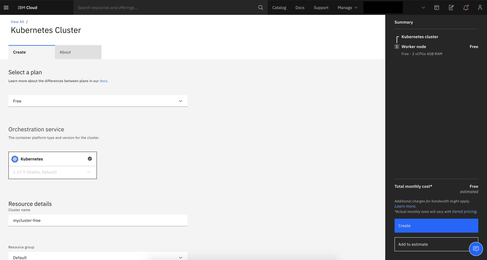
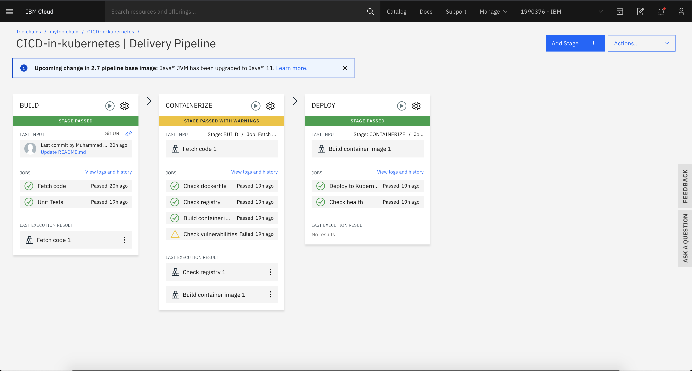
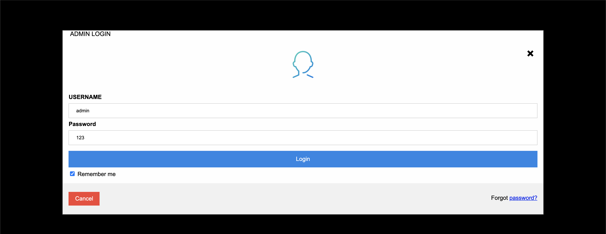
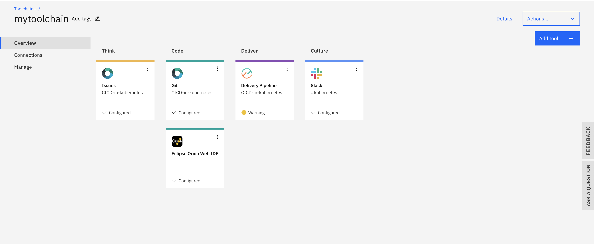
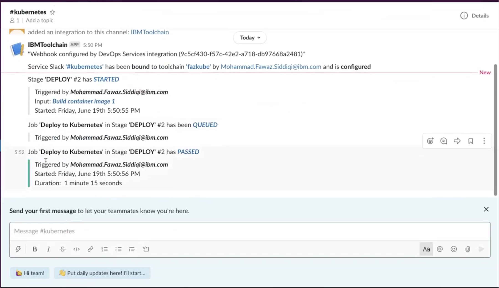

**Integrate a CI/CD pipeline to a Kubernetes cluster with Slack**

_Use a toolchain to maintain apps running on the IBM Cloud Kubernetes Service and send notifications to a Slack channel_

As enterprises move workloads to the cloud, transparency and visibility across development and operations (DevOps) teams are really important. The real power of the Slack messaging platform is to help teams collaborate and coordinate their work no matter where they are located, in the field office, at home, or anywhere around the globe. This tutorial shows you how to set up a toolchain of IBM Cloud services that uses a continuous integration and continuous delivery (CI/CD) stack to maintain and deploy applications running on a Kubernetes cluster. Then, it shows how you can enhance the collaboration experience within your DevOps team by integrating the toolchain with the Slack platform so your Slack channel receives notifications about deployment activities.

## Prerequisites

You need the following tools to complete the steps in this tutorial:

* [IBM Cloud](https://cloud.ibm.com/registration) account.
* Access to the [IBM Cloud Kubernetes Service](https://cloud.ibm.com/kubernetes/catalog/create) to create a Kubernetes cluster. If needed, you can create [one free cluster](https://cloud.ibm.com/docs/containers?topic=containers-cs_ov#cluster_types) for 30 days to get familiar with Kubernetes capabilities.
* [Slack workspace](https://slack.com/intl/en-ca/help/articles/206845317-Create-a-Slack-workspace).
* [Visual Studio Code](https://code.visualstudio.com/) or another integrated development environment (IDE) for local development.
* A [GitHub](https://github.com/) account and some knowledge of [Git commands](https://training.github.com/).

## Steps

1. [Fork and clone the GitHub repository](#step-1-fork-and-clone-the-github-repository)
1. [Create a Kubernetes cluster](#step-2-create-a-kubernetes-cluster)
1. [Create the container registry](#step-3-create-the-container-registry)
1. [Configure a toolchain](#step-4-configure-a-toolchain)
1. [Verify the application is running](#step-5-verify-the-application-is-running)
1. [Activate the Slack API](#step-6-activate-the-slack-api)
1. [Integrate your Slack app with your toolchain](#step-7-integrate-your-slack-app-with-your-toolchain)
1. [Change the toolchain and check updates on Slack](#step-8-change-the-toolchain-and-check-updates-on-slack)

### Step 1. Fork and clone the GitHub repository

1. Open the [GitHub repository](https://github.com/mahsankhaan/CICD-in-kubernetes-service-with-integration-of-Slack-platform) that contains the sample code for this tutorial.
1. Click __Fork__ from the menu bar to copy the repository into your GitHub account. You will use the URL of your forked repository in [Step 4](#step-4-configure-a-toolchain).
1. Open your terminal and change your directory by using the `cd downloads` command (or any other directory in which you want to clone the project).
1. Run the `git clone https://github.com/mahsankhaan/CICD-in-kubernetes.git` command.
1. Move into the cloned folder and run the `npm install` command to install the dependencies.
1. Run the `node app.js` command to check that the application runs successfully on you local device.

__Note:__ The project contains the Dockerfile and deployment files that you use in the next few steps, so please go through the file. This tutorial does not focus on how to write these two files, but if you want to learn more, [read our complete tutorial](https://github.com/marketplace) or [watch the video](https://www.youtube.com/watch?v=_oKqtRf0aSY). __(EDITOR NOTE: These two URLs do not work. What are the correct ones?)__

### Step 2. Create a Kubernetes cluster

1. Log into your IBM Cloud account and navigate to the [Kubernetes Cluster](https://cloud.ibm.com/kubernetes/catalog/create) page.
1. Create a Kubernetes cluster. If you need assistance, refer to the steps in the [Getting started with IBM Cloud Kubernetes Service](https://cloud.ibm.com/docs/containers?topic=containers-getting-started) documentation.

  

It may take 10 to 15 minutes for your Kubernetes cluster to provision.

### Step 3. Create the container registry

1. Go to the [Container Registry page](https://cloud.ibm.com/kubernetes/catalog/registry) within IBM Cloud.
1. Click the __Create__ button.
1. Within the __Location__ drop box, select the region that is closest to you geographically.
1. Click the __Namespaces__ tab.
1. Click __Create__.
1. In the __Create namespace__ pane, enter a unique name for your registry within the __Name__ field.
1. Click __Create__.

__Note:__ Although you could skip this step and directly integrate the container registry within [Step 4](#step-4-configure-a-toolchain), it could cause an error if your registry name is not unique.

### Step 4. Configure a toolchain

Toolchains provide an integrated set of tools to build, deploy, and manage your apps. By creating a toolchain on IBM Cloud, you can develop and deploy an application securely into a Kubernetes cluster managed by the IBM Cloud Kubernetes Service. The toolchain includes [Vulnerability Advisor](https://cloud.ibm.com/docs/va) to provide a secure container.

After you create the toolchain in this step and push the changes to your repository, the delivery pipeline will automatically build and deploy the code. [Learn more about creating toolchains on IBM Cloud.](https://www.ibm.com/cloud/architecture/toolchains)

Perform the following tasks:

1. Go to the [Create a Toolchain dashboard](https://cloud.ibm.com/devops/create) within IBM Cloud.
1. There are many ready-made toolchains are available on the dashboard. Select __Develop a Kubernetes app__.
1. Enter any name you want within the __Toolchain Name__ field.
1. In the __Select Region__ field, choose the same location as the one you chose in [Step 3](#step-3-create-the-container-registry).
1. In the __Select a source provider__ field, choose __Git Repos and Issue Tracking__.
1. Within the __Tool Integrations__ section, in the __Source repository URL__ field, enter the URL of the forked repository that you created in [Step 1](#step-1-fork-and-clone-the-github-repository).
1. Click the __Delivery Pipeline__ tab.
1. In the __App name__ field, enter `mypipeline`.
1. In the __IBM Cloud API key__ field, click the __New__ button.
1. In the __Create a new API key with full access__ window, select __OK__.
1. In the __Container registry region__ and __Cluster region__ fields, select the region where you created your services earlier.
1. Click the __Create__ button.
1. After the Delivery Pipeline status box indicates that it is configured successfully, click it to open the Delivery Pipeline status page.

  

  The screen capture of the Delivery Pipeline page shows the three pipeline stages:

  * __Build:__ If a `manifest.yml` file exists in the root folder, it is used to determine which buildpack to use.
  * __Containerize:__ This stage checks for the Dockerfile in your root folder, creates a container registry after the image is successfully built, and deploys the image in the registry. This stage also checks for any vulnerabilities in the image, and if there are any, then images with high warnings will not deploy.
  * __Deploy:__ This stage checks for cluster readiness and namespace existence, configures the cluster namespace, updates the `deployment.yml` manifest file, and grants access to the private image registry.

__Note:__ The screen capture image displays a warning because we did not activate the SSL certificate.

### Step 5. Verify the application is running

1. Within the Deploy stage, click __View logs and history__.
1. Select __Deploy to Kubernetes__.
1. Scroll to the end of the logs, until you reach `VIEW THE APPLICATION AT:` followed by a URL.
1. Open your browser and run the URL to check whether the application is running.

  

Now you will verify if the services are running on your Kubernetes cluster.

1. Go to the __[Resource list](https://cloud.ibm.com/resources)__ in IBM Cloud.
1. Expand __Cluster__ and click on the Kubernetes cluster service that you created in [Step 2](#step-2-create-a-kubernetes-cluster).
1. Within your cluster service page, select __Kubernetes dashboard__ from the menu bar.
1. Within the side panel of the Kubernetes dashboard, click __Namespaces__.
1. Select __default__ from the Namespaces list.
1. Check the services running as `hello-app`.

### Step 6. Activate the Slack API

If you do not already have a Slack account, [create one](https://slack.com/get-started#/create) before starting the following tasks to activate the Slack API.

1. Within your browser, go to [https://api.slack.com/apps](https://api.slack.com/apps).
1. Click __Create an App__.
1. Within the __Create a Slack App__ window, enter `IBM Toolchain` in the __App Name__ field.
1. In the __Development Slack Workspace__ drop down list, select the workspace that you identified or created to fulfill the [Prerequisites](#prerequisites) for this tutorial.
1. Click __Create App__. After your app is created, you will be redirected to the settings page for your new app.
1. Select __Incoming Webhooks__.
1. Set __Activate Incoming Webhooks__ to __On__.
1. Click __Add New Webhook to Workspace__.
1. Pick a channel from the list that you want the app to post notifications to.
1. Click __Allow__.
1. Back on the __Incoming Webhooks__ page, there is a new entry within the __Webhook URL__ section for the channel you selected. Click the __Copy__ button to save the URL for an upcoming task.

### Step 7. Integrate your Slack app with your toolchain

Now that your Slack app is set up, you can integrate it with your toolchain in IBM Cloud.

1. Go to the [__Toolchains__ dashboard](https://cloud.ibm.com/devops/toolchains) within IBM Cloud.
1. In the __Location__ list, choose the region where you created your toolchain in [Step 4](#step-4-configure-a-toolchain).
1. Select your toolchain from the list.
1. On you toolchain overview page, click the __Add tool__ button.
1. Type `Slack` in the search box and click the __Slack__ integration option that appears.
1. On the __Configure Slack__ page, paste the webhook URL that you copied at the end of [Step 6]((#step-6-activate-the-slack-api)) into the __Slack webhook__ field.
1. Within the __Slack channel__ field, enter the name of the channel that you selected in Step 6 to post notifications to.
1. In the __Slack team name__ field, enter the name of your Slack team. (To find your team name, open your Slack workspace, expand your workspace name located in the side panel, and copy the word or phrase that appears before `.slack.com`.)
1. Click the __Create Integration__ button. Your toolchain overview page will now display your Slack integration within a __Culture__ section of the pipeline.

  

1. Open your Slack workspace. Inside the configured channel will be a message stating that your Slack service has been bound to your toolchain.

### Step 8. Change the toolchain and check updates on Slack

1. From your toolchain overview page, click the Delivery Pipeline status box to open the Delivery Pipeline status page.
1. Within the __Deploy__ stage, click the __Run Stage__ icon.
1. The stage will start running and verification messages will appear in your Slack workspace channel. In a real world scenario, everyone on your team would have better visualization of the project changes through these types of automated deployment messages.

  

## Conclusion

In this tutorial, you learned how to work with toolchains to manage applications running on a Kubernetes cluster with automated stages that replace the manual interaction of development and operations teams. In addition, this tutorial demonstrated how the Slack platform can enhance DevOps collaboration by integrating it with an IBM Cloud toolchain to verify executions performed by a specific role. Teams could use DevOps toolchains for multi-staging strategies as part of their best practices. For example, before deploying a complete workload to a production Kubernetes cluster, it could be deployed in the test environment stage and not affect the production environment if there are any failures.
